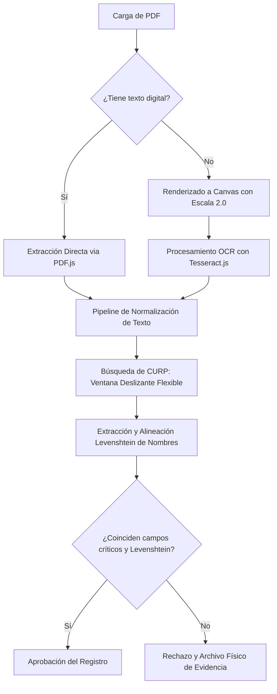

# Documentación Técnica de Arquitectura: Validador de Identidad y CURP con OCR
**Autor:** Antigravity (Senior Software Architect)  
**Proyecto:** PlanValida (Sistema de Validación Cruzada con OCR Local)

Este documento detalla la arquitectura de software, los algoritmos matemáticos y las herramientas del sistema implementados en **PlanValida** para garantizar una tasa de falso positivo del 0% y una alta resiliencia ante el ruido típico de la extracción por visión artificial (OCR).

---

## 1. Arquitectura General del Pipeline de Validación

El sistema opera bajo un esquema de **validación cruzada y de tolerancia asimétrica**. El objetivo es verificar que los datos capturados en el formulario del sistema coincidan exactamente con la información oficial plasmada en el documento PDF de la CURP provisto por el ciudadano.



El pipeline de procesamiento se divide en dos flujos según el tipo de documento:
1. **Documentos Digitales (Seleccionables)**: Extracción directa de strings a través de la API de PDF.js. Es un proceso determinista y ultra rápido (tiempo de ejecución: ~50ms).
2. **Documentos Escaneados (Imágenes)**: Renderizado de la página a un elemento `<canvas>` en memoria con una escala de resolución de 2.0 (para duplicar la densidad de píxeles y mejorar la precisión del OCR). Luego, se procesa con Tesseract.js localmente en el cliente mediante un Web Worker dedicado.

---

## 2. Algoritmos Matemáticos y Técnicas Implementadas

### A. Distancia de Levenshtein (Métrica de Edición)
Para tolerar pequeñas variaciones tipográficas en la lectura de imágenes escaneadas (por ejemplo, confundir un carácter `I` con `l` o `O` con `0`), implementamos la métrica de distancia de Levenshtein.

La distancia de Levenshtein entre dos cadenas $a$ y $b$ se define como el número mínimo de operaciones de edición de un solo carácter (inserciones, eliminaciones o sustituciones) necesarias para transformar $a$ en $b$. Matemáticamente se expresa de forma recursiva como:

$$\text{lev}(a, b) = \begin{cases} 
\max(|a|, |b|) & \text{si } \min(|a|, |b|) = 0, \\
\min \begin{cases} 
\text{lev}(\text{tail}(a), b) + 1 \\ 
\text{lev}(a, \text{tail}(b)) + 1 \\ 
\text{lev}(\text{tail}(a), \text{tail}(b)) + \theta(a[0] \neq b[0]) 
\end{cases} & \text{en otro caso.}
\end{cases}$$

Donde $\theta(a[0] \neq b[0])$ es $0$ si los caracteres son iguales, y $1$ en caso contrario.

**Implementación en el Proyecto**:
Establecemos un umbral dinámico de tolerancia de distancia de edición:
* Para palabras cortas ($\le 4$ caracteres): Máximo $1$ de distancia.
* Para palabras largas ($> 4$ caracteres): Máximo $2$ de distancia.
* Esto nos permite evitar que nombres cortos diferentes (ej. "Ana" e "Ira") coincidan por error, mientras que apellidos largos (ej. "Mancilla" y "Manc11la") sean corregidos exitosamente.

### B. Ventana Deslizante Flexible (Sliding Window) para CURP con Ruido
El OCR de Tesseract.js suele añadir caracteres espurios de ruido (como puntos, barras, o letras leídas de elementos visuales adyacentes) en los extremos de la clave CURP (ej. leer `PEGGO40506HMCRRSAG6` en vez de `PEGG040506HMCRRSA6`, insertando una `G` espuria antes del verificador final).

Para solucionar esto de manera robusta, implementamos una **ventana deslizante de tamaño variable ($18$ y $19$ caracteres)** sobre el texto crudo sin espacios extraído del PDF:
1. **Ventana de 18 caracteres**: Compara el string del documento contra la CURP esperada del formulario de forma exacta (con sustitución de caracteres visualmente similares como `O` por `0`).
2. **Ventana de 19 caracteres (Tolerancia a Inserción)**: Si se captura un fragmento de 19 caracteres, el algoritmo genera recursivamente todas las 19 variantes posibles de 18 caracteres eliminando exactamente un carácter a la vez.
3. Para cada variante de 18 caracteres resultante, se evalúan de forma estricta los campos críticos de la CURP. Si una de las variantes pasa la validación estricta y tiene una distancia de Levenshtein $\le 3$ con la CURP esperada, el sistema **descarte de forma automática el ruido** y aprueba el documento.

### C. Validación Estricta de Subcampos de Identidad
Aunque permitimos búsqueda difusa mediante Levenshtein para iniciales y consonantes internas en la CURP escaneada, **no se permite ninguna variación** en los subcampos críticos que definen la identidad del ciudadano. El algoritmo valida con una coincidencia del 100% las siguientes subcadenas extraídas de la clave:
* **Fecha de Nacimiento (índices 4 al 9)**: Debe coincidir exactamente con el año, mes y día correspondientes.
* **Sexo (índice 10)**: Debe ser idéntico (`H` o `M`).
* **Entidad Federativa (índices 11 y 12)**: Clave de estado en México (ej. `MC`, `DF`, `GT`).
* **Homoclave y Dígito Verificador final (índices 16 y 17)**: Excluye manipulaciones malintencionadas de usuarios que intenten validar una CURP ajena modificando el dígito final.

### D. Expansión Inteligente de Límite Derecho (Smart Boundary Expansion)
Para evitar que un usuario engañe al sistema omitiendo segundos nombres (ej. escribir solo `JOHAN` cuando el PDF oficial dice `JOHAN JOSUE`), implementamos una expansión de coincidencia hacia la derecha:
* El algoritmo localiza de forma difusa el primer término en el texto crudo del PDF.
* A partir de esa posición, expande la coincidencia palabra por palabra hacia la derecha capturando los caracteres adyacentes.
* La expansión se detiene de forma inteligente cuando se topa con palabras de parada generales (como etiquetas del formato de la CURP: `CURP`, `FECHA`, `SEXO`), preposiciones no válidas, ruido de OCR no alfabético, o palabras de contexto del propio ciudadano (como sus propios apellidos detectados).
* Esto nos permite extraer la cadena completa de nombres del PDF (`JOHAN JOSUE`) y contrastarla de forma estricta contra el formulario, rechazando omisiones de segundos nombres.

### E. Normalización Contextual Separada (Ñ vs X)
Para evitar fallos de identidad críticos (ej. aceptar falsamente que el apellido `GARDUÑO` coincide con `GARDUXO`):
* **Cotejo de nombres**: La letra `Ñ` y la `X` se tratan de forma literal y diferenciada. `GARDUÑO` contra `GARDUXO` generará un rechazo inmediato por discrepancia de nombres.
* **Cálculo estructural de CURP**: Únicamente dentro de la función que valida la estructura alfanumérica de la CURP (`calculateCurpInitials`), la letra `Ñ` se convierte internamente a `X` de acuerdo con el formato oficial de RENAPO, aislando la regla para que no interfiera con la validación de identidad en texto claro.

---

## 3. Optimizaciones de Rendimiento y Experiencia de Usuario

### A. Hot Caching (Caché en Caliente en Memoria)
Dado que la extracción por OCR mediante redes neuronales en Tesseract.js consume considerables recursos de CPU y demora entre 5 y 10 segundos, implementamos una caché en memoria en el cliente:
* Al procesar el PDF por primera vez, el texto plano extraído (`rawText`) y el tipo de PDF (`pdfType`) se guardan en variables de estado globales en el frontend.
* Si el usuario realiza un cambio manual en cualquiera de los campos del formulario (ej. corrige una letra de su nombre o su CURP), el sistema **no vuelve a invocar el OCR ni a leer el PDF**. 
* En su lugar, el pipeline utiliza de forma transparente los datos de la caché en memoria, re-validando toda la información de manera instantánea en **menos de 2 milisegundos**.

### B. Patrón de Diseño Debounce
Para evitar saturar la interfaz de usuario con validaciones en cada pulsación de tecla durante la edición manual de los inputs, aplicamos un patrón de **debounce de 300ms**:
```javascript
if (revalidationTimeout) {
  clearTimeout(revalidationTimeout);
}
revalidationTimeout = setTimeout(() => {
  runValidationPipeline();
}, 300);
```
Esto retrasa la ejecución de la validación en caliente hasta que el usuario ha dejado de escribir por al menos 300ms, optimizando la fluidez y el consumo de CPU.

---

## 4. Stack de Herramientas y Librerías Utilizadas

El proyecto fue desarrollado utilizando tecnologías web nativas para asegurar portabilidad y fácil despliegue:

* **PDF.js (Mozilla)**: Biblioteca de visualización de PDF de alto rendimiento escrita en JavaScript. Se utiliza en el cliente para parsear la estructura binaria del PDF y renderizar páginas en `<canvas>` HTML5 a resoluciones específicas (escala 2.0) optimizadas para OCR.
* **Tesseract.js**: Puerto de la biblioteca de OCR C++ Tesseract de código abierto de Google adaptado a WebAssembly. Utiliza redes neuronales basadas en memoria a corto y largo plazo (LSTM) que se ejecutan directamente en un Web Worker en segundo plano en el navegador web del cliente, eliminando la necesidad de un servidor dedicado de visión artificial.
* **Node.js + Express**: Servidor backend ligero encargado de servir la aplicación estática, proveer APIs para persistir los ciudadanos en una base de datos local basada en JSON (`database.json`), y gestionar físicamente el repositorio de evidencias.
* **Multer**: Middleware de Node.js diseñado para el manejo de `multipart/form-data` que nos permite procesar la carga binaria de archivos PDFs en memoria antes de moverlos y guardarlos físicamente en los directorios correspondientes según el estatus (`validos/` o `evidencias/`).
